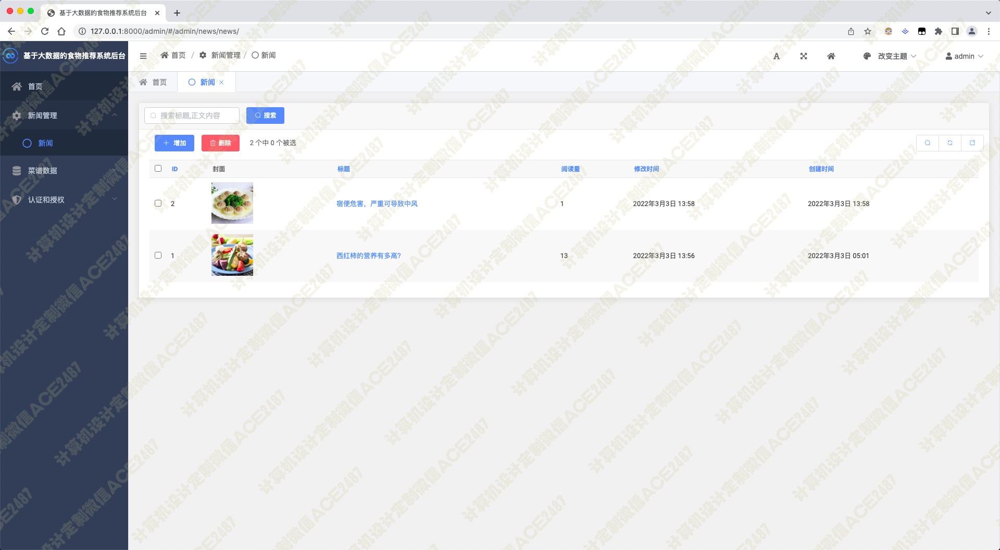

# 014 基于大数据的食物推荐系统-设计源码展示

> **代码有偿获取 可接受定制 微信联系方式: csbysj2020 或 ACE2487，备注(BS)**

> 

> 

## 技术栈

python scrapy vue 爬虫 下厨房 美食推荐 菜谱分析 食品推荐 django 饮食新闻 菜谱收藏

## 视频

> **点击查看 \>\>\> [https://www.bilibili.com/video/BV1hg41197fx/](https://www.bilibili.com/video/BV1hg41197fx/)**

## 截图

